# How pricing flows: build → pack → quote

This is costQL end to end: a new API arrives, the engine calibrates it into a static **pricing pack**, and from then on any app quotes queries against that pack locally: no server, no network, no re-measurement. The cost **unit** is always *work-ms* (summed real work; see [One currency, three fidelities](tiers.md)); the tiers differ only in how sharply the API lets costQL **see and factor** that work.

**Nature of each step:** the engine is 100% **deterministic** code (no LLM in the pricing
path). The only non-engine touches are (a) a human-authored adapter at onboarding,
and (b) an outside service (e.g. an LLM) that lives *inside the API being priced*, whose
call costQL times and whose host it names, but never invokes or prices itself.

```mermaid
flowchart TD
  subgraph LEGEND["LEGEND - nature of each step (the engine has NO agentic / LLM step)"]
    direction LR
    L1["DETERMINISTIC engine step<br/>plain code: schema walk, HTTP calls,<br/>a numeric regression, static analysis<br/>reproducible + auditable"]
    L2["HUMAN-AUTHORED once, at onboarding<br/>the API adapter (real inputs)"]
    L3["OUTSIDE CALL = a measured COST, not a step<br/>only if the API being priced calls one<br/>(e.g. an aiSummary resolver -> Haiku);<br/>costQL times it + names the host, never invokes or prices it"]
  end

  Start(["A new API arrives to be priced"]) --> S1

  %% ---------------- BUILD PHASE: learn the cost model ----------------
  S1["1 - Introspect the API live<br/>build its cost graph (types + resolvers)<br/>no schema file is kept in costQL's core"]
  S1 --> S2["2 - Mine real inputs  (API adapter, authored once)<br/>real ids / args so the sample queries actually run"]
  S2 --> S3["3 - Generate the coverage panel<br/>a targeted set of REAL queries:<br/>isolating + varied combinations + several sizes<br/>each run repeatedly under low contention"]
  S3 --> S4{"4 - What can this API expose?<br/>= the highest tier it affords"}

  S4 -->|"black box only"| T1
  S4 -->|"per-resolver timings"| T2
  S4 -->|"timings + sharing trace"| T3

  subgraph UNIT["HOW THE COST UNIT IS FACTORED  -  the unit is ALWAYS work-ms = summed real work (never elapsed wall-clock time)"]
    direction TB
    T1["T1 - CHEAP  (black box)<br/>----------<br/>Sees ONLY the whole-query wall-clock time<br/>(a low-fidelity stand-in for work-ms)<br/>Each resolver's cost is BACKED OUT by<br/>regression across many different queries<br/>BLUR: work done in parallel or batched<br/>hides inside elapsed time  ->  under-counts"]
    T2["T2 - MIDDLE<br/>----------<br/>Sees EACH resolver's own work-ms and<br/>sums the real durations<br/>(the count of calls x each call's weight)<br/>SHARING INFERRED: a call reused by<br/>several fields is guessed, not observed<br/>->  shared work can be double-counted"]
    T3["T3 - EXPENSIVE<br/>----------<br/>Sees each resolver's work-ms PLUS the<br/>sharing trace (which calls coalesced / deduped)<br/>Shared calls counted ONCE, and each shared loader<br/>priced by a LEARNED batch-size curve work-ms = f(distinct keys)<br/>(a 300-key batch costs more than a 3-key one;<br/>DB loader rises, network loader stays flat)<br/>outside hosts are named (host + call count)<br/>->  exact factoring, nothing hidden"]
  end

  T1 --> S5
  T2 --> S5
  T3 --> S5

  S5["5 - Fit the cost model<br/>solve:  op_cost  =  sum over resolvers of<br/>( invocations  x  unit_cost )<br/>result: one unit_cost per resolver"]
  S5 --> S6["6 - Observe result sizes<br/>keep BOTH the typical (average) size<br/>and the worst-case size per resolver"]
  S6 --> S7["7 - Record observed outside calls<br/>for each bounded field that calls an outside host,<br/>the engine saves the HOST it observed (host only, no fee)<br/>surfaced in a quote for the app to price  (T3 names the resolver)"]
  S7 --> S8["8 - Grade accuracy on a HELD-OUT set<br/>predict prices, then run those queries for real,<br/>compare predicted vs measured<br/>= costQL rating its own accuracy"]

  %% ---------------- HANDOFF: the static pricing pack ----------------
  S8 --> PACK[["PRICING PACK - the build-to-use handoff<br/>ONE static, self-contained file:  schema + cost model + observed outside hosts<br/>no server · no sidecar · no extra API call · no re-measure<br/>vendor it into the app, or even embed it in the API's own docs"]]

  %% ---------------- USE PHASE: price a query (app side, local) ----------------
  subgraph APPSIDE["APP SIDE - a quote is pure LOCAL computation from the pack (no service)"]
    direction TB
    Q(["Price a query  (a QUOTE - the query is NOT run)"])
    Q --> P1
    P1["Predict it from the pack ALONE - EVERY query, seen or unseen<br/>(the pack stores no query prices; there is no lookup)<br/>price = sum of  unit_cost  x  invocations<br/><br/>invocations = fanout counts multiplied down the query tree<br/>size basis:  average size (the typical)  OR  worst-case size (the safe max)<br/>T3 prices each SHARED loader by its learned batch-size curve<br/>->  shared work counted once, a big batch costing more than a small one<br/>(outside calls are named for the app to price; not in this total)"]
    P1 --> P2{"is the query's size RUNTIME-UNKNOWABLE?<br/>(a) cyclic recursion re-enters a type via a list edge, OR<br/>(b) >=2 un-paginated list edges compound on one path"}
    P2 -->|"no  -  size is bounded / declared"| P3["HIGH confidence<br/>quote it"]
    P2 -->|"yes  -  size is data-dependent"| P4["LOW confidence<br/>structural quote + FLAG + caveat<br/>(ceiling stays SAFE; for an exact number, run it once  ->)"]
    P3 --> Out(["Priced query + confidence tag<br/>(the seller's app turns cost-units into money)"])
  end

  PACK --> Q
  P4 -->|"run it once (opt-in)"| P9
  P9["Exact cost from a RUN's work-ms receipt (the sharing trace)<br/>- OUTSIDE the local-only zone: this path actually RUNS the query.<br/>Reached ONLY when a caller opts in for an exact number on a<br/>low-confidence quote - never a cached panel price."]
  P9 --> Out

  %% ---------------- styling ----------------
  %% tiers (measurement fidelity)
  classDef cheap fill:#7c3f2e,stroke:#e8a87c,color:#fff;
  classDef mid   fill:#3a5a78,stroke:#8fb8d8,color:#fff;
  classDef exp   fill:#2e5e46,stroke:#86c9a0,color:#fff;
  class T1 cheap;
  class T2 mid;
  class T3 exp;

  %% nature of each step
  classDef engine fill:#eef2ff,stroke:#7f8fd0,color:#111;
  classDef human  fill:#fff3d1,stroke:#d9a300,color:#111;
  classDef extcost fill:#f3e0f0,stroke:#b567a4,color:#111;
  classDef pack fill:#dff3f7,stroke:#1b7f95,color:#111,stroke-width:3px;
  class S1,S3,S4,S5,S6,S8,P1,P2,P3,P4,P9 engine;
  class S2,S7 human;
  class PACK pack;
  class L1 engine;
  class L2 human;
  class L3 extcost;
```

## The same flow, as commands

- **Build** (seller side, once per schema: steps 1–8 above):
  `costql build --adapter examples/adapters/rickmorty.py:rickmorty_config --out pack.json`
- **Quote** (app side, local, the query is not run):
  `costql quote --pack pack.json '<query>'`, or in Python,
  `from costql import PricingPack; PricingPack.load("pack.json").quote(query)`.
  Quote-side is also available in JavaScript via the `costql` npm package.
- **Validate** (any result against the frozen contract):
  `costql validate --pack pack.json`

Every quote and receipt follows the frozen [output contract](contract.md); the
held-out grading in step 8 is specified in [the evaluation methodology](evaluation.md).
